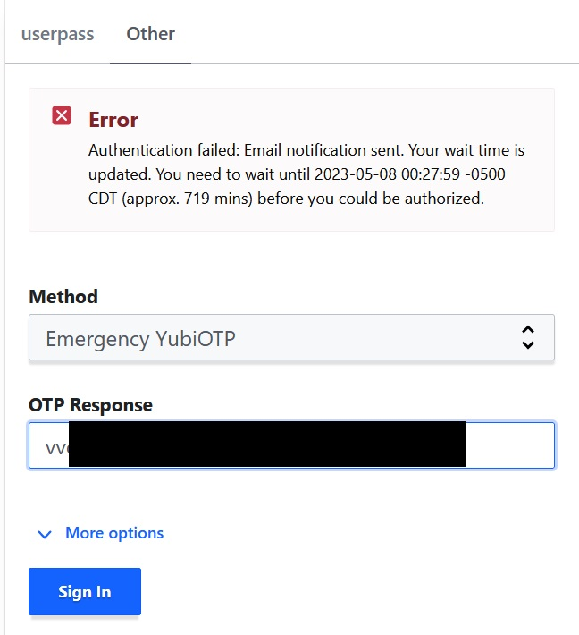

# Vault Emergency Access using a YubiOTP

This repository contains a Vault plugin that allows for emergency access to Vault using a Yubikey OTP.

## Features

* Emergency access to Vault using a Yubikey OTP
* Time delay between first login and access to Vault
* Email notification
* Support for multiple Yubikeys with individual identities and time delays

## Installation

Copy the built plugin binary to the plugin directory. Then we need to add the binary sha256 into the plugin catalog so the vault server knows the binary is legit.

```sh
vault write sys/plugins/catalog/auth/vault-auth-emerg-yubiotp \
    sha_256=7ee7f4238340cab11152047733ab4e32769664806e10f3440d9f39b45e3461ce \
    command=vault-auth-emerg-yubiotp
```

Then we enable the auth method and write in our first emergency key.

## Usage

### Global Configuration


```sh
vault write auth/emerg-yubiotp/config \
    smtp_host=smtp.invalid \
    smtp_from=somebody@somewhere.invalid \
    smtp_to=somebody@somewhere.invalid \
    smtp_username=somebody \
    smtp_password=xxxxxxxx \
    smtp_port=465 \
    yubiauth_client_id=12345 \
    yubiauth_client_key=xxxxxx
```

### Key Management

Adding a key:

```sh
$ vault write auth/emerg-yubiotp/key/somebody \
      alias=somebody \
      public_id=vvxxxxxxx \
      entity_id=xxx-xxx-xxx \
      delay=2880 delay_mail=720
```

Deleting a key:

```sh
$ vault delete auth/emerg-yubiotp/key/somebody
```

Listing all keys:

```sh
$ vault list auth/emerg-yubiotp/key
Keys
----
somebody
```

Setting Key Eligible Times:

```sh
$ vault write auth/emerg-yubiotp/key/somebody \
      next_eligible_time=-1 # disable key
$ vault write auth/emerg-yubiotp/key/somebody \
      next_eligible_time=0 # reset waiting period, next login or renew will restart waiting period
$ vault write auth/emerg-yubiotp/key/somebody \
      next_eligible_time=1 # grant access immediately
```


### Login

```sh
$ vault write auth/emerg-yubiotp/login otp_response=vvxxxxxxx
Error writing data to auth/emerg-yubiotp/login: Error making API request.

URL: PUT https://vault.yumechi.jp/v1/auth/emerg-yubiotp/login
Code: 403. Errors:

* Email notification sent.
Your wait time is updated.
You need to wait until 2023-05-08 03:30:19 -0500 CDT (approx. 719 mins) before you could be authorized.

$ vault write auth/emerg-yubiotp/login otp_response=vvyyyyyyy # after 720 minutes or manually granted access
Key                                Value
---                                -----
token                              xxxx
token_accessor                     xxxx
token_duration                     1h
token_renewable                    true
token_policies                     ["default"]
identity_policies                  ["default"]
policies                           ["default"]
token_meta_yubikey_name            somebody
token_meta_yubikey_public_id       vvyyyyyyy
token_meta_session_counter         n/a
token_meta_session_counter_used    n/a
token_meta_yubikey_alias           somebody-key-1
token_meta_yubikey_entity_id       xxx-xxx-xxx
```


## Web UI

A patch for the Vault Web UI is available [here](ui-patch/vault-ui-auth-emerg-yubiotp.patch) that adds the "emergency YubiOTP" auth method to the login page.



## License

This code is licensed under the MPLv2 license.
